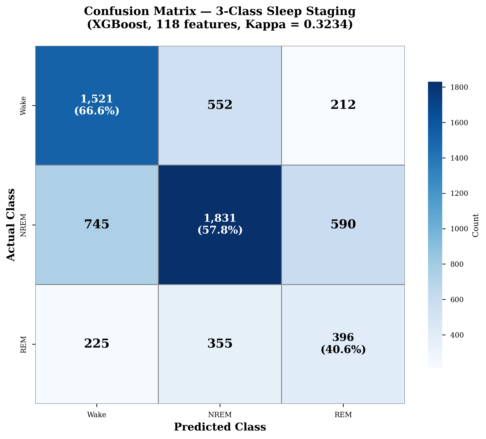

# GitHub Repository Setup Guide

**How to prepare and publish your Sleep Stage Classification project on GitHub**

---

## 📋 Pre-Publication Checklist

### 1. Review All Files

**Check for sensitive information:**
- [ ] No patient identifiable information (names, IDs)
- [ ] No absolute file paths (e.g., `/Users/syed/...`)
- [ ] No API keys or credentials
- [ ] No institutional data (if restricted)
- [ ] No email addresses (except generic contact)

**Replace absolute paths with relative:**
```python
# ❌ Bad:
data_dir = '/Users/syed/Documents/University/Y3S2/FYP/Fresh_Start/PSG_Data'

# ✅ Good:
data_dir = 'data/raw/PSG_Data'
```

### 2. Create `.gitignore`

**Required entries:**
```gitignore
# Data files (too large for GitHub)
*.pkl
*.csv
*.edf
*.wav
data/raw/
data/processed/

# Python
__pycache__/
*.py[cod]
*$py.class
*.so
.Python
venv/
env/

# IDEs
.vscode/
.idea/
*.swp
*.swo
*~

# OS
.DS_Store
Thumbs.db

# Jupyter
.ipynb_checkpoints/

# Large models (use Git LFS or host separately)
models/*.pkl
models/*.json

# Results (include summary CSVs, exclude large files)
results/*.png
results/*.pdf
!results/*_summary.csv
!results/feature_importance.csv
```

### 3. Create `requirements.txt`

```txt
numpy>=1.21.0
pandas>=1.3.0
scikit-learn>=1.0.0
xgboost>=1.7.0
scipy>=1.7.0
matplotlib>=3.4.0
seaborn>=0.11.0
tqdm>=4.62.0
```

**Generate from your environment:**
```bash
pip freeze > requirements.txt
```

### 4. Create `LICENSE`

**Recommended: MIT License**

```
MIT License

Copyright (c) 2025 [Your Name]

Permission is hereby granted, free of charge, to any person obtaining a copy
of this software and associated documentation files (the "Software"), to deal
in the Software without restriction, including without limitation the rights
to use, copy, modify, merge, publish, distribute, sublicense, and/or sell
copies of the Software, and to permit persons to whom the Software is
furnished to do so, subject to the following conditions:

The above copyright notice and this permission notice shall be included in all
copies or substantial portions of the Software.

THE SOFTWARE IS PROVIDED "AS IS", WITHOUT WARRANTY OF ANY KIND, EXPRESS OR
IMPLIED, INCLUDING BUT NOT LIMITED TO THE WARRANTIES OF MERCHANTABILITY,
FITNESS FOR A PARTICULAR PURPOSE AND NONINFRINGEMENT. IN NO EVENT SHALL THE
AUTHORS OR COPYRIGHT HOLDERS BE LIABLE FOR ANY CLAIM, DAMAGES OR OTHER
LIABILITY, WHETHER IN AN ACTION OF CONTRACT, TORT OR OTHERWISE, ARISING FROM,
OUT OF OR IN CONNECTION WITH THE SOFTWARE OR THE USE OR OTHER DEALINGS IN THE
SOFTWARE.
```

---

## 🚀 GitHub Setup Steps

### Step 1: Create GitHub Repository

1. **Go to GitHub.com**
2. **Click "New repository"**
3. **Settings:**
   - Name: `sleep-stage-classifier` or `imu-sleep-staging`
   - Description: "Automated sleep stage classification using IMU sensors - NTU CS FYP"
   - Visibility: **Public** (for portfolio) or **Private** (if required)
   - ✅ Initialize with README: **No** (you have your own)
   - ✅ Add .gitignore: **None** (you have your own)
   - ✅ Choose license: **None** (you have your own)
4. **Click "Create repository"**

### Step 2: Initialize Local Repository

```bash
cd /Users/syed/Documents/University/Y3S2/FYP/Sleep_Stage_Classifier_Clean

# Initialize git
git init

# Add all files
git add .

# First commit
git commit -m "Initial commit: Sleep stage classification system

- Data synchronization pipeline
- Enhanced feature engineering (97 features)
- XGBoost model (Kappa 0.290)
- Hardware deployment on nRF52840
- Comprehensive documentation"
```

### Step 3: Connect to GitHub

```bash
# Add remote (replace with your URL)
git remote add origin https://github.com/YOUR_USERNAME/sleep-stage-classifier.git

# Push to GitHub
git branch -M main
git push -u origin main
```

### Step 4: Verify Upload

1. Go to your GitHub repository URL
2. Check all files uploaded correctly
3. Verify README displays properly
4. Check no sensitive data included

---

## 📦 Large Files Management

### Option A: Git LFS (Large File Storage)

**For files 50MB - 2GB:**

```bash
# Install Git LFS
git lfs install

# Track large files
git lfs track "*.pkl"
git lfs track "models/*.json"

# Add .gitattributes
git add .gitattributes

# Commit and push
git commit -m "Add Git LFS tracking"
git push
```

**Limits:**
- Free tier: 1 GB storage, 1 GB/month bandwidth
- May need paid plan for full dataset

### Option B: External Hosting

**For very large files (>2GB):**

Host on external platforms and link in README:
- Google Drive
- Dropbox
- Zenodo (for research data)
- University file server

**In README.md, add download links:**
```markdown
## Dataset

Due to size constraints, the dataset is hosted externally:

- **Processed Dataset (4.2 MB):** [Download](https://drive.google.com/...)
- **Trained Models (900 KB):** [Download](https://drive.google.com/...)

Place downloaded files in:
- Dataset: `data/processed/sleep_dataset_optimized.pkl`
- Model: `models/xgboost_best.pkl`
```

### Option C: Provide Sample Data

**For privacy/size reasons, provide subset:**

```bash
# Create sample dataset (first 100 epochs)
import pickle
import numpy as np

# Load full dataset
with open('sleep_dataset_optimized.pkl', 'rb') as f:
    data = pickle.load(f)

# Sample
sample_data = {
    'X_all_features': data['X_all_features'][:100],
    'y_3class': data['y_3class'][:100],
    'patient_ids': data['patient_ids'][:100],
    'feature_names': data['feature_names'],
    'n_features': data['n_features']
}

# Save
with open('sample_dataset.pkl', 'wb') as f:
    pickle.dump(sample_data, f)
```

**Add note in README:**
```markdown
**Note:** For privacy and size reasons, only a sample dataset (100 epochs) is
included. The full dataset (6,427 epochs) is available upon request for
research purposes.
```

---

## 🎨 Enhance Repository

### Add Badges (Optional)

**At top of README.md:**
```markdown
[](https://www.python.org/)
[](https://xgboost.readthedocs.io/)
[](https://opensource.org/licenses/MIT)
[](https://www.nordicsemi.com/Products/nRF52840)
```

### Add Images

**Create `docs/images/` directory:**

```bash
mkdir -p docs/images
```

**Add:**
1. **System architecture diagram** (`docs/images/architecture.png`)
2. **Confusion matrix** (`docs/images/confusion_matrix.png`)
3. **Feature importance plot** (`docs/images/feature_importance.png`)
4. **Hardware photo** (`docs/images/hardware.jpg`)
5. **Results progression** (`docs/images/results.png`)

**Reference in README:**
```markdown
## System Architecture


## Results


```

### Add Topics (GitHub)

**On GitHub repository page:**
- Click "⚙️ Settings" (top right near "About")
- Add topics: `sleep-staging`, `machine-learning`, `wearables`, `embedded-ml`, `xgboost`, `imu`, `fyp`

---

## 📱 Create GitHub Pages (Optional)

**Turn README into website:**

1. **Go to repository Settings**
2. **Pages section (left sidebar)**
3. **Source:** Deploy from branch `main` / `docs` folder
4. **Wait 2-3 minutes**
5. **Your site:** `https://YOUR_USERNAME.github.io/sleep-stage-classifier/`

**Create `docs/index.md`:**
```markdown
# Sleep Stage Classification

[Copy content from README.md]
```

---

## 🔗 Link to Your Portfolio

**Add to your personal website/CV:**

```markdown
### Sleep Stage Classification System (NTU FYP)
*Python, XGBoost, Embedded ML*

- Developed automated sleep staging using only IMU sensors (Kappa 0.29)
- Engineered 97 features with patient-specific normalization (+13.5x improvement)
- Deployed on embedded hardware (nRF52840) with 12ms real-time inference
- Systematically evaluated multimodal features (IMU, audio)

[GitHub](https://github.com/YOUR_USERNAME/sleep-stage-classifier) | [Demo](#) | [Report](#)
```

---

## 📄 Repository Structure Check

**Final structure should be:**

```
sleep-stage-classifier/
├── .gitignore
├── LICENSE
├── README.md                      # Main overview
├── REPORT_GUIDE.md                # FYP report guide
├── RESULTS_SUMMARY.md             # All results
├── GITHUB_SETUP_GUIDE.md          # This file
├── requirements.txt               # Dependencies
│
├── data/
│   ├── README.md                  # Data documentation
│   └── sample/                    # Sample data (if public)
│
├── src/
│   ├── preprocessing/
│   │   └── synchronize_psg_imu.py
│   ├── feature_engineering/
│   │   └── enhanced_features.py
│   ├── modeling/
│   │   └── train_xgboost.py
│   └── evaluation/
│       └── feature_importance.py
│
├── hardware/
│   ├── firmware/                  # Arduino code
│   └── model_export/              # C header files
│
├── results/
│   ├── feature_importance.csv
│   └── performance_summary.csv
│
└── docs/
    ├── images/                    # Figures
    └── references/                # Papers
```

---

## ✅ Final Checklist

**Before making repository public:**

### Code Quality
- [ ] All scripts run without errors
- [ ] No hardcoded paths
- [ ] Comments added to complex code
- [ ] Function docstrings present
- [ ] No debugging print statements

### Documentation
- [ ] README.md complete and accurate
- [ ] All metrics match results
- [ ] Installation instructions tested
- [ ] Usage examples work
- [ ] Links not broken

### Data Privacy
- [ ] No patient identifiers
- [ ] No restricted data
- [ ] Sample data or download links provided
- [ ] Ethics/IRB approval mentioned (if applicable)

### Professional Presentation
- [ ] LICENSE file included
- [ ] requirements.txt complete
- [ ] .gitignore covers all large/sensitive files
- [ ] Commit messages are clear
- [ ] No merge conflicts

### Testing
- [ ] Clone repository fresh
- [ ] Test installation from requirements.txt
- [ ] Run sample code
- [ ] Verify README instructions
- [ ] Check on different computer (if possible)

---

## 🎓 For FYP Submission

### Include GitHub Link

**In your report:**
```
Source Code: https://github.com/YOUR_USERNAME/sleep-stage-classifier

All code, documentation, and results are available in the repository.
```

**In appendices:**
- Link to specific important files
- Include key code snippets
- Reference GitHub for full implementation

### Archive Repository

**Create release for submission:**

1. **Go to repository**
2. **Releases → Create new release**
3. **Tag:** `v1.0-fyp-submission`
4. **Title:** "FYP Final Submission"
5. **Description:**
   ```
   Final Year Project submission for NTU CS.

   Sleep Stage Classification using IMU Sensors
   - Kappa: 0.290
   - Accuracy: 59.1%
   - Hardware deployment on nRF52840

   Submitted: [Date]
   Supervisor: [Name]
   ```
6. **Attach ZIP** of full code (optional)
7. **Publish release**

This creates permanent snapshot at submission time.

---

## 🚀 Post-Graduation

### Make Repository Shine

1. **Add demo GIF**
   - Record hardware demo
   - Convert to GIF
   - Add to README

2. **Create Jupyter notebook demo**
   - Interactive results exploration
   - Feature importance visualization
   - Model prediction examples

3. **Write blog post**
   - Explain project to broader audience
   - Link to GitHub
   - Share on LinkedIn

4. **Submit to showcases**
   - NTU project showcase
   - Student research conferences
   - GitHub "Trending" (with good README + topics)

### Continuous Improvement

**Post-FYP enhancements:**
- Implement feedback from reviewers
- Add more models
- Improve documentation
- Fix any bugs
- Add more visualizations

**Keep repository active:**
- Shows ongoing learning
- Demonstrates to employers
- Helps future students

---

## 📞 Questions?

**Common Issues:**

**Q: Repository too large (>100MB warning)**
- Use Git LFS for large files
- Or remove large files and link externally

**Q: Private repository for FYP?**
- Can keep private during marking
- Make public after graduation
- Set visibility in Settings

**Q: Should I include raw data?**
- Usually NO (privacy, size)
- Include sample or synthetic data
- Or provide access request process

**Q: What about patient data ethics?**
- Check IRB/ethics approval
- De-identify all data
- Follow data sharing agreement
- When in doubt, DON'T include

---

**Your repository is ready! Time to share your work with the world!** 🌟

**GitHub URL:** `https://github.com/YOUR_USERNAME/sleep-stage-classifier`
